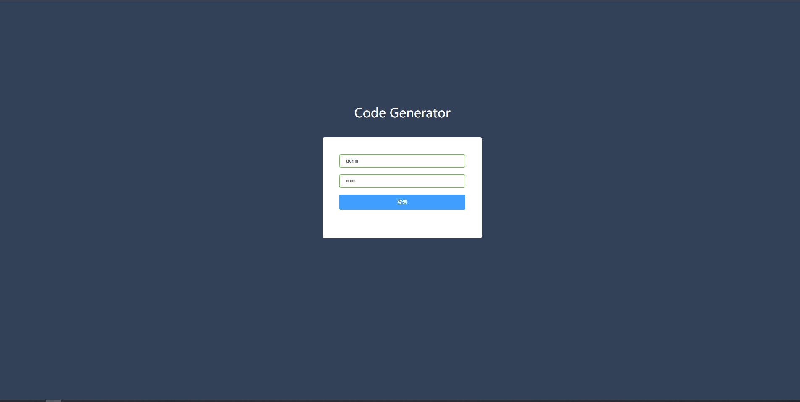
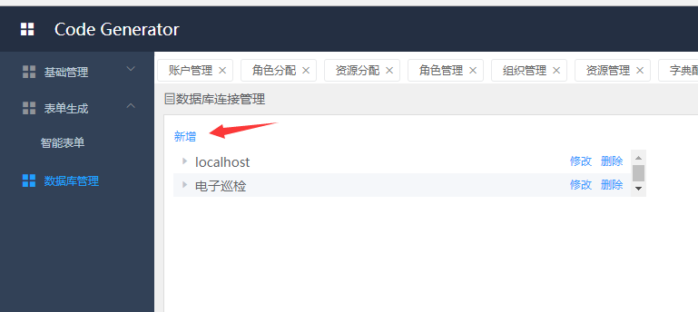
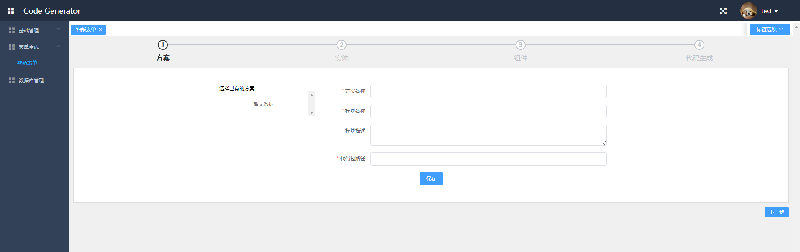

# CodeGenerator(代码生成器)
### 概述
系统只生成后台代码，后台架构为MVC + Mybatis。
首先，系统集成mybatis-generator官方代码生成器，可以自动生成实体、mapper接口以及xml配置文件。
然后使用velocity模板引擎生成service接口和实现类以及controller。并重写了entity。

### 程序入口
1. 前端页面存放在resource/static下，启动springboot后，访问localhost:8082/codegenerator/index.html即可。

### 准备工作
- 首先，初始化数据库，sql文件在doc/sql下。
- 在application.yml 中配置数据库信息。

   ```
       url: jdbc:mysql://localhost:3306/codegenerator
       username: root
       password: xxxxxx
   ```

- 在application.yml 中配置代码的输出路径。

   ```
   
   #代码输出目录
   outputPath: d:/code
   ```

- 页面登录密码：admin/123456

   

- 由于生成器是通过数据库表生成后台代码及前端页面，所以需要首先配好数据库连接。
   

- 最后安装流程指引完成页面生成。
   

### 缺点

- 代码生成器只能根据数据库表生成前后端源码，并没有生成所在的框架环境。生成的源代码文件需要依赖于特定环境才能适用。如生成的后台代码可能适用到一些工具类，在本项目结构下是适用的，但如果其它环境则需要修改才能适用。当然你也可以直接修改模板文件，dao层及以下是mybatis-generator生成，如需改动，需要修改mybatis-generator官方源码。[mybatis-generator](https://github.com/mybatis/generator)

  本系统的模板文件在resource/velocity/ 下，适用velocity后端模板引擎，可以自行修改。

- 前端代码生成文件为vue源码文件，项目路径为：[codegenerator_web](https://github.com/JaylenLiu/CodeGenerator_web.git)

  


### mybatis-generator

mybatis-generator是mybatis官方提供的代码生成器。其主要根据数据库表生成实体类以及与数据库交互的接口层。
其主要配置文件是resource下的generatorConfig.xml。xml中有详细的注释说明，其中较为重要的配置包括：
- defaultModelType<br>
\<context\>标签中的defaultModelType决定生成的实体结构。
<br>flat:实体所有内容（主键，blob）等全部生成在一个对象中。
<br>hierarchical:会把blob、text类型单独形成一个实体对象。
- targetRuntime<br>
主要是选择生成代码的模式。
    - MyBatis3 ：生成基于MyBatis3.x以上版本的内容，包括XXXBySample。
    - MyBatis3Simple：类似MyBatis3，只是不生成XXXBySample。
    - MyBatis3DynamicSql：动态sql，支持java8 lambda表达式。
### 目录结构介绍
- base包主要是基础类声明，将公共的方法抽离出来，减少代码重复，提高代码复用率。
- commom包主要是公共类。包括统一异常处理类，自定义异常类，http状态码枚举类，分页过滤器，统一的信息类以及代码生成的工具类。
- entity包主要是实体类。生成的实体类与普通实体类不同之处在于使用了lombok。只需要在实体声明前面加上
  @Data,即可自动添加get、set、toString、hashcode、equals等。如使用Intellij IDEA 则需要安装插件才能识别。
- util: 工具类中DatabaseUtil可以获取数据库的元信息。StringContextUtil可以获取spring上下文,但只能通过request获取，使用时不太方便，然后新增ApplicationContextProvider满足更多场景。
- aspect: 通过aop进行日志记录。
